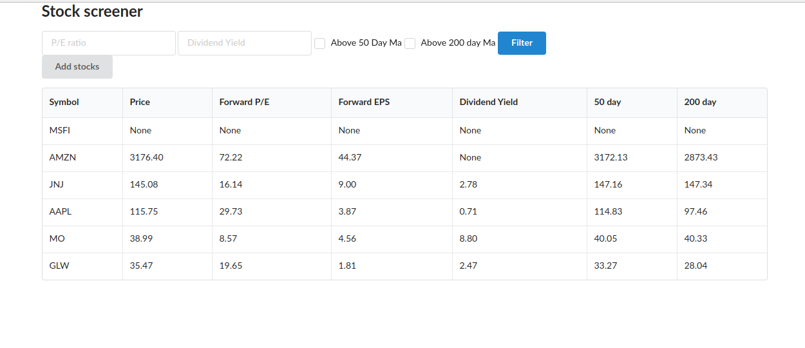
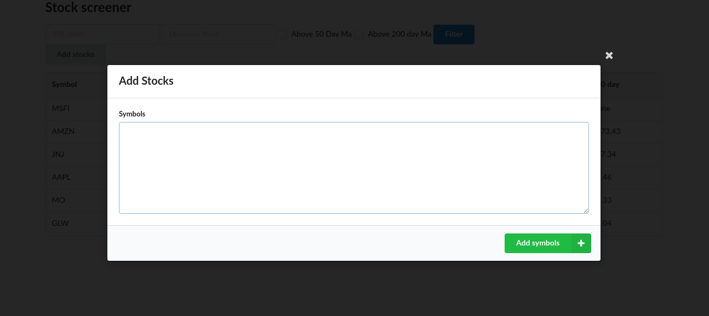

## Learning FAST API 

Creating simple API to manage historical info about companies -> Ifinance Python Library

Based on Youtube tutorial -> to prepare for my own project in FAST API

- Front-end -> Semantic UI
- Testing API -> Insomnia
- DB -> SQLite + SQLAlechemy

Some screens:

